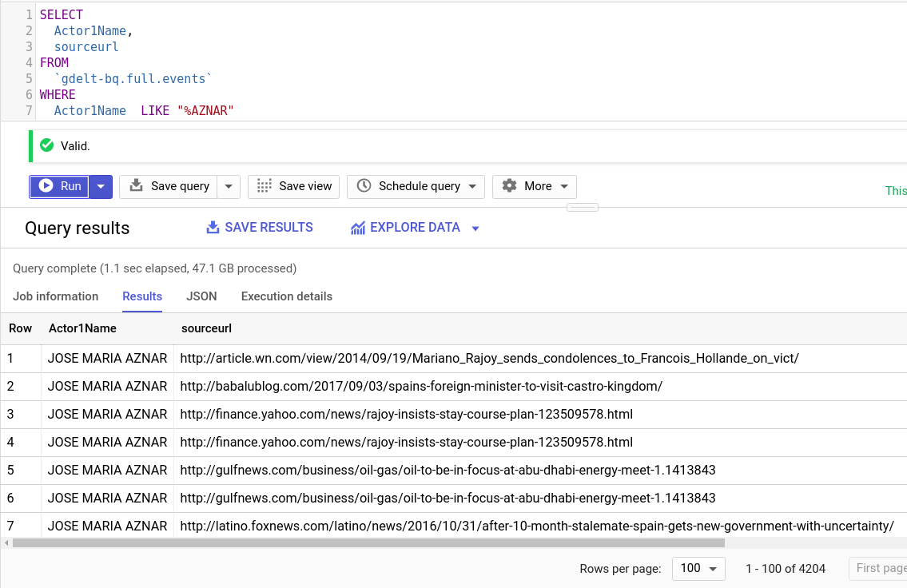
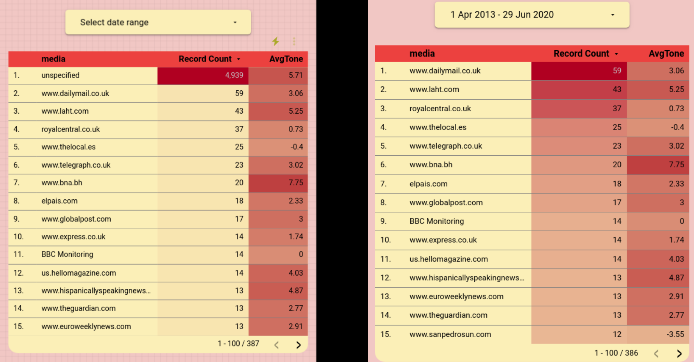
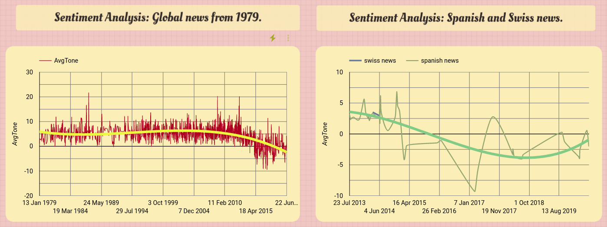

# Controversial public figures with Gdelt.

- Disclaimer: **This is not political propaganda of any kind**. *I am just an analytic person who have questions and love researching instead of blindly believing rumors.*

- Dashboard (under construction) => https://datastudio.google.com/s/nShAIQD96fc

# Introduction.

I like reading "alternative" sources, like **reddit**, **hackernews** or **meneame**, and once in a while I read some news about delicate matters involving the King Emeritus of Spain. This articles always express a deep frustration about how this news are not being published in his country.

So, the questons I am trying to answer are the following: 

**Question 1:** Are the spanish news not publishing the same than the rest of world about the King Emeritus of Spain?

**Question 2:** Do we have a method to impartially contrast it?

I wanted to check if the second question could be answered with the Gdelt Project, a huge database, ingesting news of the whole planet every 15 minutes. It is not just the crazy ingestion pipeline, you also can find all the information processed and classified, by themes, by people, by country, by media source… By sentiment of the news. Certainly Asimov would be proud.

The first question... It needs some research, and that is precisely what I did with the Gdelt database and BigQuery. 

# Methodology.

- Use of `gdelt-bq.full.events` table.
- Creation of a dataset containing about 250 different spanish newspapers. 
- Filter by Actor1Name and SourceURL in Gdelt.

#### Filtering by ulr:

After little research I discoverd almost all famous newspapers in Switzerland have the **.ch** domain, except *romandie.com* and *agefi.com*, so I did not create a table for swiss media, just filtered by domain including this 2 sources.

As said above, I created a table in BigQuery for the spanish media (not all spanish newspapers end up with **.es** domain). In *filtering_by_spain_switzerland* folder you can find the swiss query and the spanish media dataset.

The Query contains 195 different swiss media (query available in *swiss_media_SourceUrl.sql*) and 250 different spanish media (*spanish_newspapres_SourceURL.py*) and has the following structure:

        SELECT
        *
        FROM (

        SELECT
            (SQLDATE),
            --EXTRACT (date
            --FROM
            --PARSE_TIMESTAMP('%Y%m%d',CAST(SQLDATE AS string))) AS Date,
            AvgTone,
            --NumArticles,
            SOURCEURL AS media,
            GoldsteinScale AS affecting_country_stability,
            
            (CASE

                WHEN ( net.host(SOURCEURL) LIKE "%.ch" OR net.host(SOURCEURL) LIKE "%romandie.com%" OR net.host(SOURCEURL) LIKE "%agefi.com%" )THEN "swiss news"

                WHEN ( net.host(SOURCEURL) LIKE "%.es" OR net.host(SOURCEURL) IN (
                SELECT
                spanish_newspapers
                FROM
                `myproject.mydataset.spanish_newspapers_SourceCommonName_160620`)
                OR net.host(SOURCEURL) IN (
                SELECT
                spanish_media
                FROM
                `myproject.mydataset.spanish_media_SourceURL`) ) THEN "spanish news"
            ELSE
                "other"
            END
            ) AS country

        FROM
            `gdelt-bq.full.events` )
        WHERE
        AND country IS NOT NULL
        AND SQLDATE >= 19790110

Voilá, now we are getting all the information classified in Spain, Switzerland, and *other countries*.

2. Filtering by Actor1Name:

As many important people, "King Juan Carlos" is an entity itself in the Gdelt Project. With this simple query, you can find all news in the world in which he is mentioned or attached to:

        SELECT * FROM 

        SELECT
            (CASE
                WHEN Actor1Name ='KING JUAN CARLOS' THEN "Rey Juan Carlos"
            END
            ) as king
        FROM
        `gdelt-bq.full.events`

        WHERE king is not null

(Always better *CASE*  than  *WHERE* statements)

**Important**: Gdelt started to append the URLs in SourceURL column of `gdelt-bq.full.events` from 2013. Before that is not possible to check where Gdelt statistics come from, but they have.

Used columns:

- SQLDATE: Date. 

- AvgTone: This is the average “tone” of all documents containing one or more mentions of this event. The score ranges from -100 (extremely negative) to +100 (extremely positive). Common values range between -10 and +10, with 0 indicating neutral. This can be used as a method of filtering the “context” of events as a subtle measure of the importance of an event and as a proxy for the “impact” of that event. For example, a riot event with a slightly negative average tone is likely to have been a minor occurrence, whereas if it had an extremely negative average tone, it suggests a far more serious occurrence. A riot with a positive score likely suggests a very minor occurrence described in the context of a more positive narrative (such as a report of an attack occurring in a discussion of improving conditions on the ground in a country and how the number of attacks per day has been greatly reduced).

- SOURCEURL: This field is only present in the daily event stream files beginning April 1, 2013 and lists the URL of the news article the event was found in. If the event was found in an article from the BBC Monitoring service, this field will contain “BBC Monitoring.” If an event was mentioned in multiple articles, only one of the URLs is provided (see the GDELT Global Knowledge Graph for the additional URLs). This field is not present in event files prior to April 1, 2013.

- GoldsteinScale: Each CAMEO event code is assigned a numeric score from -10 to +10, capturing the theoretical potential impact that type of event will have on the stability of a country. This is known as the Goldstein Scale. This field specifies the Goldstein score for each event type. NOTE: this score is based on the type of event, not the specifics of the actual event record being recorded – thus two riots, one with 10 people and one with 10,000, will both receive the same Goldstein score. This can be aggregated to various levels of time resolution to yield an approximation of the stability of a location over time

- Actor1Name: The actual name of the Actor 1. In the case of a political leader or organization, this will be the leader’s formal name (GEORGE W BUSH, UNITED NATIONS), for a geographic match it will be either the country or capital/major city name (UNITED STATES / PARIS), and for ethnic, religious, and type matches it will reflect the root match class (KURD, CATHOLIC, POLICE OFFICER, etc). May be blank if the system was unable to identify an Actor1.

# 3. Results.

- King tag:
    
    - I found disappointing the obtaining rows regarding the King Emeritus. They are just a few (about 6k rows from 1979 all over the world). For instance, an important ex politician from Spain (prime minister from 1996 to 2004) has 4k.

    - Are the daily life, duties and controversial facts of a for-8-years president more relevant than of a more-than-35-years King? On my behalf: Nope, but I am not in charge of the Gdelt Project.

- Table with just recognized spanish and swiss media regarding the King Emeritus:

    - Query available in table_just_for_spanish_swiss_media.sql
    - It gave 75 results from 2013. 6 from the Switzerland filter (8%), the rest from the Spain filter.
    - They are just very few results, it is shocking.

- Table requesting all the information regardless the domain or source:

    - Query available in table_all_media.sql
    - It gave 6274 results from 1979.
    - Again, it is just very few results, taking into account we are analyzing the whole planet.

- Sources all times VS sources from 1979.
    
    - Before 2013 there were 4k unspecified sources with very positive sentiment.
    - *elpais.com* is the only spanish media in top15 mentioning news about the King Emeritus, with a slight positive sentiment (AvgTone = Average Tone of the article).

- Sentiment Analysis regarding King Emeritus articles:
    - Swiss news in which *Actor1Name = "KING JUAN CARLOS"* are practically inexistent, just a few. Are the Swiss media not publishing news about the Spanish King? I certainly doubt it. I think it is more possible this public figure is not well tagged and processed by the Gdelt people.
    - It is interesting to appreciate how the Average Tone curve keeps decaying in the whole planet, nevertheless in Spain it starts to increase in the end. I do not know what it means, but I know that King Juan Carlos University (Madrid) is slightly responsible for some bad and good news about our *Actor1Name*. Lets analyse those peaks (you can use the time selector in the Dashboard):

- 25/12/2013: 
- 18/06/2014:
- 15/12/2014:
- 07/03/2015:
- 23/03/2016:
- 23/03/2017:
- 02/08/2018:
- 24/03/2020:

# 4. Conclusion.

- **Question 1:** Is the spanish media hiding delicate articles about certain public figures? 

If my code is right, it is not possible to know using the Gdelt Database because they do not tag in every written article the public figure I am trying to analyse. 

- **Question 2:** Can we use the Gdelt Database to monitor *sometimes controversial* public figures? 

The answer seems to be: It depends on what public figure you want to monitor.

# 5. Bibliography.

- https://www.reddit.com/r/gdelt/comments/g7tiyw/results_filtering_actorcountrycode/

- https://www.gdeltproject.org/

-------------------------
-------------------------

If it is of interest:
 
Automated ETL in Google Cloud Monitoring Google Searches, Twitter and news media in Spain:

- Repo => https://github.com/albertovpd/automated_etl_google_cloud-social_dashboard

- Dashboard => https://datastudio.google.com/u/0/reporting/755f3183-dd44-4073-804e-9f7d3d993315/page/LrATB

